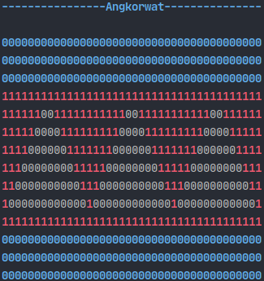

# Cambodia flag
Welcome to funny linux custom terminal. Here is the tiny work to display   *Cambodia Flag* in Linux terminal.

# Here it is!



# How to install!
- copy file [flagkh](flagkh) to /usr/bin, type ``sudo cp flagkh /usr/bin ``
- allow file ```flagkh``` to be executable, under directory /usr/bin use command ```sudo chmod +x flagkh``` 
- after completed setup, type ``flagkh`` will see flag.